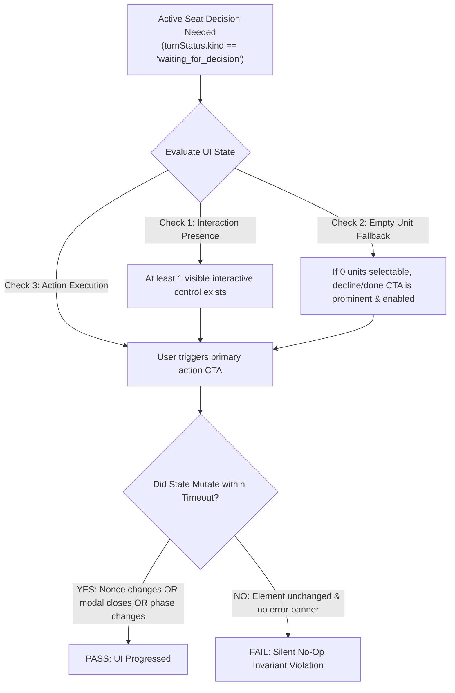
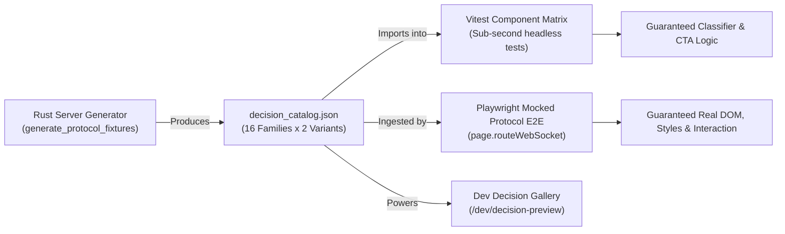
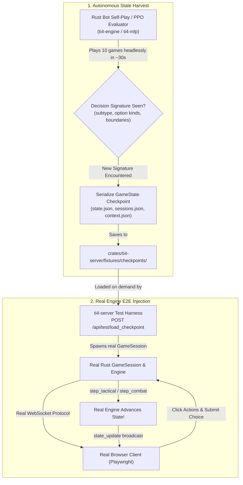

# Web UI E2E Invariant Test Improvement Plan

## 1. Executive Summary & Objective

The TI4 Web UI test suite verifies several static and structural properties (SVG rendering, connection health, privacy redaction of hidden cards, non-negative victory points, and initial strategy card drafting). However, it contains a critical blind spot: **it does not assert UI liveness or progressibility**.

In multiple real gameplay states—such as a tactical action activating a system where no ships are within movement range—the user interface can enter a state where clicking interactive controls (e.g., clicking "Done Moving" or clicking on the board) silently does nothing, deadlocking game progression. Because current E2E tests terminate after the strategy draft and rely exclusively on passive DOM checks, these deadlocks pass undetected.

Furthermore, reaching every possible decision type during a live playthrough (combat casualties, planetary invasion, agenda voting, timing-window reactions, trade desk transactions) is combinatorial, fragile, and prohibitively slow.

This plan specifies:
1. The architecture and invariants needed to prevent UI progression deadlocks in live games.
2. A **decoupled synthetic mocking architecture** to exhaustively test all 16+ decision types and their boundary conditions in milliseconds without having to reach every state through a live game.

---

## 2. Root Cause Analysis & Coverage Gaps

### 2.1 Premature Test Truncation in E2E
* In [`web/e2e/multiplayer_invariants.spec.ts`](web/e2e/multiplayer_invariants.spec.ts), the test titled `'multi-seat strategy draft, live sync, redaction, and randomized actions'` only drafts strategy cards for Player 1 and Player 2.
* Player 3 is never handled. The game never enters the **Action Phase**.
* No tactical actions, system activations, fleet movements, combat resolutions, agenda voting, or production cycles are exercised in the browser.

### 2.2 Passive Invariants vs. Liveness Invariants
The existing [`assertPageInvariants`](web/e2e/multiplayer_invariants.spec.ts#L7-L43) checks only static DOM state:
1. Connection indicator has `data-status="connected"`.
2. `[data-testid="ti4-board-svg"]` is visible.
3. Private cards of opponents/spectators are redacted from the DOM.
4. Player VP strings parse to non-negative numbers.

None of these assertions verify that the active player actually has an enabled, functional action path that transitions the game.

### 2.3 The "0 Ships to Move" Failure Mechanism
When a player executes a tactical action on a system that no friendly ships can reach:
1. **Engine Output**: The engine emits a decision with subtype `"movement_step"` containing only one option: `{ id: "done_moving", kind: "decline", label: "finish movement" }`.
2. **Overlay Logic in [`TacticalMovementOverlay.tsx`](web/src/components/TacticalMovementOverlay.tsx)**:
   * `shipGroups` is empty, rendering `"No ships eligible to move into the active system."`.
   * `totalUnitsStaged` is `0`.
   * In `handleCommitMoves`:
     ```typescript
     if (totalUnitsStaged === 0) {
       if (doneMovingOption) {
         setIsDirectSubmitting(true);
         try {
           await onSubmit(doneMovingOption.id);
         } finally {
           setIsDirectSubmitting(false);
         }
       }
       return; // SILENT NO-OP if doneMovingOption is missing or undefined!
     }
     ```
   * If `doneMovingOption` fails to resolve (due to kind mismatch, naming divergence, or model derivation differences), clicking `commit-moves-btn` silently returns. The UI does not dispatch a request, renders no error message, and leaves the user stalled.
3. **Board Canvas Disconnect**:
   * On the SVG board ([`Board.tsx`](web/src/components/Board.tsx)), no system hex is flagged as `data-target-candidate` because `done_moving` lacks target coordinates in its payload.
   * Clicking the destination system hex opens the [`SystemInspector`](web/src/components/SystemInspector.tsx), but `availableActions` is empty because `targetsThisSystem` evaluates to false.
   * If the player minimizes or closes the tray, clicking the map or inspector provides zero affordances to conclude movement.

---

## 3. Core Invariant Formulations

To ensure games cannot stall, the test suite must enforce four formal UI invariants:



### Invariant 1: Active Decision Progressibility (Liveness)
> **Definition**: Whenever `turnStatus.kind === 'waiting_for_decision'` for a viewer's seat, the rendered DOM must expose at least one primary interaction element (button, card selector, or targetable board element) that is visible, enabled, and aria-accessible.
> 
> When activated, it MUST produce a verifiable state change (nonce update, choice dialog unmount, or turn status change) within a bounded window ($\le 5000\text{ ms}$).

### Invariant 2: Terminal / Decline Fallback Availability
> **Definition**: Whenever an active workflow presents 0 valid selectable resources or units (e.g., 0 movable ships, 0 exhaustible planets, 0 valid targets), the workflow MUST NOT wait for an impossible user selection.
>
> The decline/done action (`done_moving`, `pass`, or `decline`) must be automatically focused or presented as the primary enabled call-to-action.

### Invariant 3: Prohibition of Silent No-Ops
> **Definition**: Clicking any interactive decision button in the UI MUST either:
> 1. Initiate an action dispatch that transitions state, or
> 2. Immediately display an explicit, accessible validation error banner explaining why the action could not proceed.
>
> Under no circumstances may an enabled button click produce zero DOM side effects and zero network activity.

### Invariant 4: Recovery from Pipeline Interruption
> **Definition**: If a sequential multi-action pipeline (via `usePipelineRunner`) fails or encounters an unexpected intermediate choice nonce, it must cleanly cancel its queue and reset `isRunning` to `false`, restoring interactivity to manual submission buttons.

---

## 4. Multi-Layer Test Architecture (Live Game Loop)

The live game test improvements will be implemented across two distinct test layers:

### Layer A: Unit & Component Property Invariants ([`web/src/test/invariants.test.ts`](web/src/test/invariants.test.ts))
1. **Decision Classifier Completeness**:
   * Property test asserting that for every known engine decision subtype, `deriveChoiceRendererModel` produces a valid `ChoiceRendererModel`.
   * Specifically assert that when `options` contains only a decline/done option, `declineOption` is non-null.
2. **0-Ship Tactical Movement Component Test**:
   * Mount `TacticalMovementOverlay` with a 0-movable-ships choice.
   * Assert empty state label is present, gauges show `0 / 3 Ships` and `0 / 0 Loaded`, `commit-moves-btn` is enabled with `"Done Moving"`, and clicking it invokes `onSubmit("done_moving")`.

### Layer B: Multi-Phase Browser E2E Suite ([`web/e2e/multiplayer_invariants.spec.ts`](web/e2e/multiplayer_invariants.spec.ts))
1. **Full Strategy Draft Completion**:
   * All three players (Player 1, Player 2, and Player 3) pick strategy cards in order until `phase === 'Action'`.
2. **Autonomous Action Phase Progression**:
   * **Step 1 (Tactical Action with Ships)**: Activate system with ships in range -> stage ships -> gauges update -> click "Commit Moves" -> verify fleet moves.
   * **Step 2 (Tactical Action with 0 Ships to Move)**: Activate an isolated system with no ships in range -> assert `commit-moves-btn` is enabled -> click `commit-moves-btn` -> assert game advances past movement within 3 seconds without stalling.
3. **Reusable Playwright Assertion Helper**:
   ```typescript
   export async function assertPlayerCanProgress(
     page: Page,
     options?: { timeoutMs?: number; label?: string }
   ): Promise<void>;
   ```
   * Locates active workflow overlay or choice dialog, identifies primary submission CTA, clicks it, and asserts nonce update or unmounting.

---

## 5. Exhaustive Decision Mocking Architecture (Decoupled from Live Game)

To achieve 100% decision coverage without playing out full games, we decouple decision testing into a **Synthetic Protocol Mocking Harness**.



### 5.1 The Authoritative Decision Catalog (`decision_catalog.json`)
We extend [`crates/ti4-server/examples/generate_protocol_fixtures.rs`](crates/ti4-server/examples/generate_protocol_fixtures.rs) to generate a versioned `decision_catalog.json`. This guarantees the synthetic fixtures are generated directly by the Rust server types and never drift.

The catalog defines every decision family in **two canonical variants**:
1. **Standard / Happy Path**: Multiple available units/options, valid targets, sufficient economy.
2. **Boundary / Empty / Decline Path**: 0 eligible units, exact funds, decline-only, max capacity reached.

#### Catalog Coverage Matrix:
| Workflow ID | Engine Subtype | Standard Variant | Boundary / Empty Variant |
|---|---|---|---|
| `system_activation` | `activate_system` | Systems with available tokens | System with pre-existing token |
| `tactical_movement` | `movement_step` | Cruisers/Carriers/Fighters with origins | **0 ships eligible (`done_moving` only)** |
| `tactical_cargo` | `load_cargo` | Ground forces & fighters across planets | 0 cargo available / decline |
| `tactical_invasion` | `commit_ground_forces` | Multiple planets & landing forces | 0 ground forces to commit |
| `payment` | `pay_resources` | Planet exhausts, trade goods | Exact funds / 0 resources remaining |
| `payment` | `pay_influence` | Planet exhausts, trade goods | Exact influence / 0 remaining |
| `payment` | `spend_command_tokens` | Tactical, fleet, strategic pools | Single token type remaining |
| `payment` | `leadership_spend_influence` | Influence options for tokens | Decline / 0 influence to spend |
| `production` | `tactical_production` | Carriers, cruisers, fighters, mechs | 0 resources or capacity reached |
| `combat_sustain` | `sustain_damage` | Dreadnoughts, mechs, flagships | Decline sustain (pass hit through) |
| `combat_casualty` | `assign_casualty` | Destroy fighters, damaged capital ships | Single remaining unit |
| `combat_retreat` | `announce_retreat` | Valid adjacent empty systems | Decline retreat |
| `agenda_vote_outcome`| `cast_vote` | For / Against / Outcome candidates | Abstain / 0 votes cast |
| `agenda_vote_planets`| `vote_exhaust_planet` | Multiple cultural/hazardous planets | 0 planets remaining to exhaust |
| `transaction_propose`| `propose_transaction` | Commodities, trade goods, notes | Empty proposal / cancel |
| `transaction_answer` | `answer_transaction` | Counterparty terms review | Decline / reject offer |
| `action_card_reaction`| `play_reaction_timing` | Sabotage, Direct Hit, Shields Holding | Pass / Decline reaction |
| `objective_scoring`  | `score_objective` | Public Stage I/II objectives | Pass / Decline scoring |
| `generic_selection`  | `generic_choice` | Bounded multi-selection (min 2, max 4) | Exactly minimum selections |

---

### 5.2 Layer 1: Headless Vitest Parameterized Matrix
File: `web/src/presentation/decisionCatalog.test.tsx`

Using React Testing Library and Vitest, this test iterates over the entire `decision_catalog.json` in memory (< 1.5 seconds total runtime):
```typescript
describe('Exhaustive Decision Catalog Invariant Matrix', () => {
  for (const entry of DECISION_CATALOG) {
    describe(`Workflow: ${entry.workflow} (${entry.subtype}) - ${entry.variant}`, () => {
      it('correctly classifies workflow and decline options', () => {
        const model = deriveChoiceRendererModel(entry.choice, entry.choice.actor);
        expect(model?.workflow).toBe(entry.workflow);
        if (entry.isDeclineOnly) {
          expect(model?.declineOption).not.toBeNull();
        }
      });

      it('renders enabled primary CTA and progress is executable', async () => {
        const onSubmit = vi.fn().mockResolvedValue(undefined);
        const { getByRole, getByTestId } = render(
          <ChoiceRendererDispatcher
            choice={entry.choice}
            viewerSeat={entry.choice.actor}
            onSubmit={onSubmit}
            isMinimized={false}
            onMinimizedChange={vi.fn()}
          />
        );

        // Assert invariant: At least one actionable button exists
        const cta = getByRole('button', { name: entry.expectedCtaPattern });
        expect(cta).toBeEnabled();

        // Trigger CTA
        fireEvent.click(cta);
        expect(onSubmit).toHaveBeenCalledWith(entry.expectedOptionId);
      });
    });
  }
});
```

---

### 5.3 Layer 2: Synthetic Protocol Ingestion in Playwright E2E
File: `web/e2e/decision_workflows_mocked.spec.ts`

To verify CSS layouts, drawers, modals, board highlights, and real WebSocket serialization in real browser engines without running a backend game:
1. Start the Vite frontend server.
2. Launch a browser page pointing to a synthetic route `/games/mock_session`.
3. Use Playwright's `page.routeWebSocket` to intercept the WebSocket connection:
   ```typescript
   test('exercises every decision type in real browser via synthetic protocol injection', async ({ page }) => {
     let currentNonce = '';
     let lastSubmittedOption = '';

     await page.routeWebSocket('/ws/games/mock_session', (ws) => {
       ws.onMessage((message) => {
         const data = JSON.parse(message.toString());
         if (data.type === 'submit_choice') {
           lastSubmittedOption = data.option_id;
           // Acknowledge by broadcasting choice resolution
           ws.send(JSON.stringify({ type: 'decision_resolved' }));
         }
       });

       // Helper to send a pending choice to the client
       async function pushDecision(decision: PendingChoiceDto) {
         currentNonce = decision.nonce;
         ws.send(JSON.stringify({
           type: 'pending_choice',
           nonce: decision.nonce,
           game_version: 1,
           choice: {
             player: decision.actor,
             prompt: decision.prompt,
             options: decision.options,
             context: decision.context,
           },
         }));
       }

       // Run loop over all catalog entries
       for (const fixture of DECISION_CATALOG) {
         await pushDecision(fixture.choice);
         await assertPlayerCanProgress(page);
         expect(lastSubmittedOption).toBe(fixture.expectedOptionId);
       }
     });
   });
   ```
4. **Execution Time**: Tests all 32+ variants across all 16 decision families in **under 8 seconds**.

---

### 5.4 Layer 3: Real GameState Checkpoint Gathering & E2E Rehydration
File: `crates/ti4-server/examples/dump_game_checkpoints.rs` & `web/e2e/checkpoint_gameplay.spec.ts`

While synthetic protocol mocking (Layer 2) tests the browser and WebSocket client in isolation, **State Gathering** bridges the entire vertical slice: it loads **real, authentic `GameState` records into the real Rust engine**, allowing Playwright to verify that the real server and engine accept and advance the state upon user interaction.



#### 1. Autonomous Engine Checkpoint Harvester
* As bots play simulated games (running 10–20 games in headless Rust via `ti4_engine`), whenever a decision matching an uncovered signature is encountered (e.g. *0-movable-ships tactical action*, *Space Cannon defense*, *Planetary Bombardment*, *Sustain Damage on Dreadnought*, *Ixthian Artifact vote*, *Direct Hit reaction window*):
  * Serialize and export:
    1. `state.json`: Fully serialized `ti4_model::GameState`.
    2. `galaxy.json`: Board map tiles and wormhole topology.
    3. `sessions.json`: Test player credentials (`x-ti4-player-session`) for each seat.
    4. `metadata.json`: The decision subtype, active seat, and expected legal options.
* Generates an entire corpus of 40+ real engine states across all game phases in under 1 minute.

#### 2. Server Test Endpoint (`POST /api/test/load_checkpoint`)
* In test mode (enabled via `--features test-support`), `ti4-server` exposes an endpoint that instantly boots a `GameSession` from any harvested checkpoint:
  ```rust
  let config = SessionConfig::new(game_id, checkpoint.state)
      .with_galaxy(checkpoint.galaxy);
  registry.create_game_from_checkpoint(config)?;
  ```
* Bypasses the lobby and preceding turns, jumping straight to the exact decision moment.

#### 3. Real Engine Checkpoint E2E Spec (`web/e2e/checkpoint_gameplay.spec.ts`)
* Playwright loads the checkpoint, opens the browser as the active seat, clicks the primary CTA, and verifies that the **real engine** resolves the decision and broadcasts the subsequent state update:
  ```typescript
  test('resolves tactical movement with 0 movable ships using real engine checkpoint', async ({ page, request }) => {
    const res = await request.post('/api/test/load_checkpoint', {
      data: { checkpoint: 'tactical_move_zero_ships' }
    });
    const { gameId, activePlayerSession } = await res.json();

    await openPlayerGame(page, gameId, activePlayerSession);

    // Verify UI renders empty state correctly
    await expect(page.locator('[data-testid="tactical-movement-tray"]')).toBeVisible();
    await expect(page.getByText('No ships eligible to move')).toBeVisible();

    // Click primary action
    const doneBtn = page.locator('[data-testid="commit-moves-btn"]');
    await expect(doneBtn).toHaveText('Done Moving');
    await doneBtn.click();

    // Verify real engine processed submission and closed movement step
    await expect(page.locator('[data-testid="tactical-movement-tray"]')).toHaveCount(0);
    await expect(page.locator('[data-testid="turn-status-bar"]')).not.toContainText('movement');
  });
  ```

---

### 5.5 Layer 4: Dev-Mode Interactive Decision Gallery (`/dev/decisions`)
Add a light development-only route in [`web/src/App.tsx`](web/src/App.tsx):
* Accessible only when `import.meta.env.DEV` is true.
* Provides a dropdown menu of all catalog fixtures and checkpoints.
* Selecting a fixture immediately hot-swaps `pendingChoice` in [`GameShell`](web/src/components/GameShell.tsx).
* Enables developers and designers to instantly preview, test, and style any workflow (e.g. 0-ship movement, 7-planet agenda vote, high-capacity production) without ever playing a game.

---

---

## 6. UI Hardening Requirements

To ensure that both live games, synthetic catalog tests, and real engine checkpoints pass, the following UI fixes are required:

### 6.1 TacticalMovementOverlay Robustness
* **Fallback Resolution**: In [`TacticalMovementOverlay.tsx`](web/src/components/TacticalMovementOverlay.tsx), if `totalUnitsStaged === 0`, ensure `doneMovingOption` resolves via:
  1. `model?.declineOption`
  2. Any option matching `id === 'done_moving'` or `kind === 'decline'`
  3. If `choice.options.length === 1`, use that single option as the terminal choice.
* **Error Banner on Unresolvable Empty State**: If no finish option can be found, set a visible alert (`data-testid="movement-error-banner"`) rather than returning silently.

### 6.2 Board Canvas Action Synchronization
* In [`Board.tsx`](web/src/components/Board.tsx#L524-L528), ensure `SystemInspector.onSelectAction` forwards the explicit `optionId` to `onSubmitChoice`, preventing system inspection clicks from being swallowed.

### 6.3 Multi-Select `min_selection: 0` Pipeline Bug Fix
* In [`PendingChoiceModal.tsx`](web/src/components/PendingChoiceModal.tsx#L194) and [`usePipelineRunner.ts`](web/src/hooks/usePipelineRunner.ts#L64): when `min_selection === 0` and zero items are selected, trigger direct submission or dispatch an empty selection intent rather than returning early without invoking `onSubmit`.

---

## 7. Architectural Tradeoff Analysis: Flakiness, Change Resistance & Isolation

When designing test suites for complex stateful games, testing approaches differ fundamentally in their operational costs:

```text
  TRADITIONAL MULTI-STEP LIVE E2E SCRIPT:
  [Step 1: Lobby] ──> [Step 2: Draft] ──> [Step 3: Action] ──> [Step 4: Move] ──> [Step 5: Combat]
         │                     │                   │                   │                   │
   Any UI change        Card timing tweak     New animation       Button rename       Dice roll variance
   BREAKS ALL           BREAKS ALL            BREAKS ALL          BREAKS ALL          FAILS RANDOMLY
   DOWNSTREAM           DOWNSTREAM            DOWNSTREAM          DOWNSTREAM          (FLAKY)
   ASSERTIONS           ASSERTIONS            ASSERTIONS          ASSERTIONS

  ISOLATED ATOMIC CHECKPOINT / SYNTHETIC HARNESS:
  [Checkpoint: 0-Ship Movement]  ──> Assert Progressibility  (Independent, 0 cascade failures)
  [Checkpoint: Space Combat]      ──> Assert Sustain/Casualty (Independent, 0 cascade failures)
  [Checkpoint: Agenda Voting]     ──> Assert Ballot/Planets   (Independent, 0 cascade failures)
```

### 7.1 Detailed Dimension Evaluation

| Testing Strategy | Flakiness Risk | Resistance to Change (Maintainability) | Failure Isolation | Execution Speed | Fidelity / Realism |
|---|:---:|:---:|:---:|:---:|:---:|
| **A. Long Live Playthrough Script** (e.g. 5-turn continuous live game) | **HIGH** (Network timing, bot races, animation delay, RNG seeds) | **VERY POOR (Fragile)**: Changing a button label or timing window in Step 2 cascades and breaks Steps 3–15. | **POOR**: Test fails with a generic timeout at Step 8; hard to diagnose root cause. | **SLOW** (~45–90s per test) | **HIGH** (Real server + client) |
| **B. Real Engine Checkpoint Rehydration** (`POST /api/test/load_checkpoint`) | **LOW–MED** (Clean server boot, deterministic state, single-step execution) | **HIGH**: Each checkpoint tests exactly one decision in isolation; changes to lobby or draft do not affect combat tests. | **EXCELLENT**: Failure immediately pinpoints the exact component/decision state that failed. | **FAST** (~1–2s per state, ~15s suite) | **MAXIMUM** (Real Rust engine, real server, real WebSocket, real browser) |
| **C. Synthetic Protocol Ingestion** (Playwright + `routeWebSocket`) | **VERY LOW** (No server dependencies, deterministic push, synchronous socket frames) | **HIGH**: Decoupled from game rules and engine logic; only depends on the public protocol schema. | **EXCELLENT**: Fails specifically on UI rendering, focus trap, or click handler errors. | **VERY FAST** (~8s for 32+ states) | **HIGH (Frontend)** (Real browser DOM, CSS, events; simulated backend) |
| **D. Headless Component Matrix** (Vitest + Testing Library) | **ZERO (Deterministic)** (Runs in Node/jsdom, 0 network, 0 rendering delays) | **MAXIMUM**: Tests pure React render logic and classifier models; updates are isolated to single component props. | **SURGICAL**: Direct stack trace to the exact line in component code that threw or failed. | **SUB-SECOND** (< 1.5s for 32+ states) | **MEDIUM** (No real layout engine, CSS styling, or real WebSocket) |
| **E. `fast-check` Property Fuzzing** | **ZERO (Deterministic)** (Uses seeded pseudorandom generation) | **HIGH**: Invariant-focused rather than scenario-focused; rules or styling changes do not break fuzzers. | **GOOD**: Shrinks failing inputs to the minimal reproducing counterexample. | **FAST** (< 2s for 1000 iterations) | **SYNTHETIC** (Generates extreme/synthetic data structures) |

---

### 7.2 Core Principles for Resistance to Change

To avoid high maintenance costs where tests constantly break on unrelated UI modifications, tests must adhere to three design rules:

1. **Atomic State Isolation over Multi-Step Cascades**:
   * Never chain 10 dependent user steps together just to test the 10th step.
   * Boot directly into the exact decision state via checkpoint or fixture. If the Strategy Draft UI is redesigned, combat and movement tests must not break.
2. **Semantic Invariant Contracts over Brittle Selectors**:
   * **Brittle**: `await page.click('div > div.panel > button:nth-child(2)')` (breaks on any CSS or layout refactor).
   * **Brittle**: `await page.click('text="Confirm Choice"')` (breaks when copy is refined or localized).
   * **Resistant**: `assertPlayerCanProgress(page)` searches for `[data-testid="commit-moves-btn"]` or any visible button with `data-actionable="true"` or `type="submit"`, asserting that activating it mutates `pendingChoice.nonce`.
3. **Decoupled Fixture Versioning**:
   * Engine fixtures are generated by the server's own test harness (`generate_protocol_fixtures`). When protocol fields change, fixtures are regenerated through a single command rather than manually rewriting dozens of test files.

---

## 8. Implementation Roadmap

| Task | Scope | Files | Flakiness | Change Resistance | Acceptance Criteria |
|---|---|---|:---:|:---:|---|
| **INV-01** | UI Movement & Board Action Hardening | `web/src/components/TacticalMovementOverlay.tsx`, `Board.tsx`, `PendingChoiceModal.tsx` | N/A | High | Zero silent no-ops when staging 0 units; board inspector forwards action IDs; `min_selection: 0` submits. |
| **INV-02** | Authoritative Decision Catalog Generator | `crates/ti4-server/examples/generate_protocol_fixtures.rs`, `decision_catalog.json` | None | High | Generates 16 workflow families $\times$ 2 variants directly from Rust server types. |
| **INV-03** | Headless Decision Catalog Matrix Test | `web/src/presentation/decisionCatalog.test.tsx` | None (0%) | Maximum | 100% of decision catalog fixtures verify classification, enabled primary CTA, and click dispatch in Vitest (< 1.5s). |
| **INV-04** | Synthetic Protocol Playwright E2E Suite | `web/e2e/decision_workflows_mocked.spec.ts` | Very Low | High | All decision catalog fixtures stream through real browser via `routeWebSocket`, verifying DOM actionability and outbound WS messages in < 10s. |
| **INV-05** | Engine Checkpoint Harvester & Server Test Loader | `crates/ti4-server/examples/dump_game_checkpoints.rs`, `ti4-server/src/http/test_routes.rs` | None | High | Headless bots harvest 20+ unique real GameState checkpoints; server boots any checkpoint on demand via `POST /api/test/load_checkpoint`. |
| **INV-06** | Real Engine Checkpoint E2E Spec | `web/e2e/checkpoint_gameplay.spec.ts` | Low | High | Tests real browser $\leftrightarrow$ real server $\leftrightarrow$ real engine transitions across complex states (0-ship move, combat, etc.) without multi-step playthrough fragility (< 15s). |
| **INV-07** | Multi-Phase Live E2E Invariant Test | `web/e2e/multiplayer_invariants.spec.ts`, `lobbyHelpers.ts` | Med | Medium | 3-seat live game drafts cards, enters Action phase, and executes tactical moves with and without units without stalling. Uses `assertPlayerCanProgress`. |
| **INV-08** | Dev-Mode Interactive Decision Gallery | `web/src/App.tsx`, `web/src/components/DecisionGallery.tsx` | N/A | High | `/dev/decisions` allows hot-swapping any catalog decision or checkpoint in DEV mode for visual QA. |

---

## 9. Verification & Success Criteria

1. **Synthetic Coverage**: `npm test` runs `decisionCatalog.test.tsx` and passes all 32+ decision fixtures in < 2 seconds.
2. **Browser Mock E2E**: `npx playwright test e2e/decision_workflows_mocked.spec.ts` passes across all decision types in < 10 seconds.
3. **Real Engine Checkpoint E2E**: `npx playwright test e2e/checkpoint_gameplay.spec.ts` rehydrates captured game states and confirms engine transitions for complex late-game situations in < 15 seconds.
4. **Live Game E2E**: `npx playwright test e2e/multiplayer_invariants.spec.ts` passes draft and Action phase tactical movement.
5. **Deadlock Regression Gate**: Deliberately commenting out `onSubmit(doneMovingOption.id)` in `TacticalMovementOverlay` causes `decisionCatalog.test.tsx`, `decision_workflows_mocked.spec.ts`, `checkpoint_gameplay.spec.ts`, and `multiplayer_invariants.spec.ts` to immediately fail with a Progressibility Invariant error.
